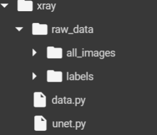
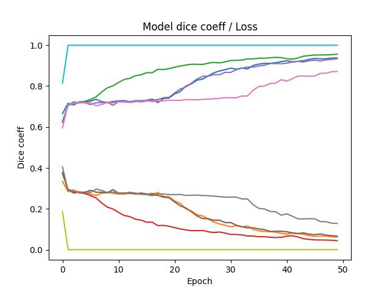
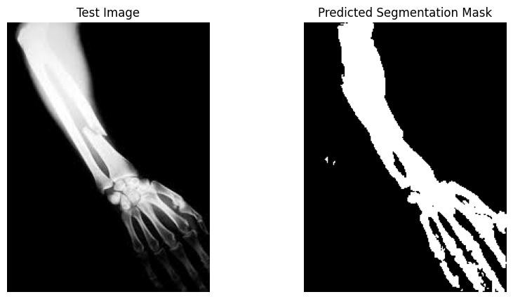

# Project Title

Bone Segmentation with U-Net

## Description

Tryin to identify the bones (only 0 and 1 not specified) with using  unet architecture on the X-Ray images data.

## Getting Started

### Dependencies

* A data set with their labels is required for this solution. Their format will be mentioned below.
* Computational power needed. Colab could be an option as a suggestion.

### Executing program
As a cookbook you can find the demo notebook at the repo. But here the short defination of base 2 classes that is used.

* DataClass has the required basic pre process and load operations for you. All you have to do is create the required folder path as shown below.

* UNet class has the model architecture with the training-testing functions as well as the required loss functions namely dice score.

## Results for my case

For my run i have faced with such table for 50 epochs run with 256x256 sized images.

I saved the best model for each fold and here the some results for a single test at demo notebook.

