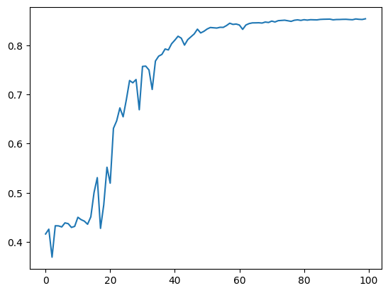

# Project Title

Bone Segmentation with U-Net

## Description

Tryin to identify the bones (only 0 and 1 not specified) with using  unet architecture on the X-Ray images data.

## Getting Started

### Dependencies

* A data set with their labels is required for this solution. Their format will be mentioned below.
* Computational power needed. Colab could be an option as a suggestion.

### Executing program
As a cookbook you can find the demo notebook at the repo. But here the short defination of base 2 classes that is used.

* DataClass has the required basic pre process and load operations for you. All you have to do is create the required folder path as shown below.

  

* UNet class has the model architecture with the training-testing functions as well as the required loss functions namely dice score.

## Results for my case

For my run i have faced with such table for 50 epochs run with 256x256 sized images.

I saved the best model for each fold and here the some results for a single test at demo notebook.

### Potential Improvement Steps
* Keep training more epochs until plateu and use lr reduction to reach better results at plateu.
* Increasing the data with using data augmentation tools.
* Optimizing the hyperparameters and constants.
* Using input images not only gray scale but with their channels and bigger sized shapes.

### What i faced for these improvement steps
* For increasing epoch numbers i didnt get much improvement but after adding reduce on plateu i have realised that my network stucks at a local minimum while trying to global minimum. Then i decided to reduce my learning rate to decrease the steps that i took.
* Since I only have 500 images and didnt want to get additional data from the internet resources the only option was using augmentation methods. After deciding that I reviewed more detailly and reach out the point which is that : I have many different parts of the body and each of them belongs to the same class which is 1 (there is bone) but the issue is that there are not enaugh representations of some bone types such as hand images. This understanding will help me while tuning the parameters. If we come to what i did for augmentation step, I have used positional augmentation steps to make my network understand the important feature is not the position. I achieve this by using flip ,zoom , orientation methods. In addition i have used some computer vision tools to apply some blur or edge detection on image. Why I used these methods will be explained in input image size and channel number.
* While starting optimization step I have covered above workload. Beacuse of this reason I have some possible optimizations in my mind. At first i tuned optimization function and learning rate as mentioned above. Tried AdamW, SGD and more... At the end of this tests I decided to keep going with Adam with fairly low lr. While augmenting data I realised the unbalanced background of this project. To overcome this problem i made a search to find best loss function that handles these type of issues. I have tried some of them but focal loss was the best one among them. However it has some pros and cons with it so during my tests i have tried using combined loss function with binary crossentropy dice and focal. At the end of the tests the most suitible one was using .15 dice loss and focal together. 
Other than these I added additional layers to increase the network capacitiy horizontally and as a result of that increased the network vertically too. These phases were realy experimental for me but as far as i understand vertically low capacity layers are necessary to get main features - details at the xray images. On the other hand using narrow backbone is kind of useless to create enaugh featured feature space. So, at the end of the trials i have decided the best one is in the new_unet.py.
* Before starting to optimization the most clear point for me was the  case of image shape and channel. If there are some features (channels) for us clearly we should use it to get better result. However things are not went like this. I have tried many many times but after a point i give up and return to gray scaled input images with no channel. I think the reason behind this was there are many empty (boneless) places at each channel and if i use three of them the networks starts to get used to it to optimize loss function. It finds a cracked way let me say and uses this bug to increase accuracy - reduce loss. There should be way to handle it but for my case i didnt get any improvements and to not lose time on that anymore i switch directly to grayscaled inputs. When we come to input shape i just take the average of the images and convert it to most close 2^ power which is 512,512.

* Additional points : Other than the previously written solutions i have tried using different models namely Unet++ or resunet. While augmentig data I have tuned the amounth of augmentation since after a point it has become harmful more than the benefits.

Some optimization tries here :

With adding channels into action with shape of : (256,256,3)  for 100 epochs :

With 2k inages : (256,256,3)  for 100 epochs :

With 2k inages : (512,512)  for 100 epochs :

With 2k inages : (128,128)  for 100 epochs :

With 1k inages : (512,512) with first combined loss for 100 epochs :

With 1k inages : (512,512) with first combined loss for 100 epochs :

Above optimized  :

Above optimized and the best one :

And its plot that has avg 9 haussdorf :

And its validation dice loss :

